  

---

### 

> **The Goal:** To develop a semi-autonomous rover capable of navigating extraterrestrial terrain, identifying viable geological samples, and retrieving them securely—keeping human astronauts safe in orbit.

---

## 📡 The Design Phase

We are currently in **Phase 1: Blueprint & Logic Mapping**. Before we cut metal, we are finalizing the chassis geometry and the sensor array integration.

| **Current Core Schematic** |
| :---: |
|  |
| *Fig 1.0: Initial Concept Draft - Focusing on high-clearance suspension.* |

*(Be sure to add your `design_sketch.png` to the `assets/images/` folder!)*

---

## 🧠 Robot Brain & Tech Stack

We are using a hybrid processing architecture to handle navigation and vision simultaneously.

### Mission Modules Structure

Instead of basic code, we are building distinct operational modules:

```mermaid
graph TD;
    A[🛰️ Mission Control] -->|Coordinates| B(🧠 Main Logic Core);
    B --> C{Obstacle Detected?};
    C -- Yes --> D[🛡️ Evasive Maneuvers];
    C -- No --> E[🔭 Scan for Samples];
    E --> F{Sample Found?};
    F -- Yes --> G[🦾 Activate Arm Sequence];
    F -- No --> B;
    G --> H[📦 Secure Storage];
    H --> B;
```

🛠️ Hardware Materials & Manifest
We have compiled the initial Bill of Materials required to move to the build phase.

<a href=""📄 CLICK HERE TO VIEW THE FULL MATERIALS PDF

Includes specs for high-torque servos, LiPo power specs, and chassis aluminum grades.
